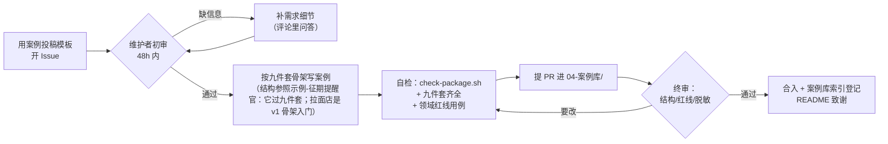

# 贡献指南

> 版本 1.2 ｜ 欢迎！这个项目=open source 一门「帮普通人落地 AI agent」的手艺。有用的贡献按价值排序：

## 什么贡献最被需要

1. **落地案例**（最高价值）：你用这套流程服务了谁、工作流长什么样、踩了什么坑 → 用 [案例投稿](.github/ISSUE_TEMPLATE/案例投稿.md) 模板开 Issue，或直接 PR 到 `02-知识库/04-案例库/`（记得脱敏：真名→化名，截图打码）。投稿流程见下方流程图
2. **专题知识**：`02-知识库/01-专题/` 的补充与纠错（渠道实测、模型实测、部署坑）——**引用须附官方文档链接或行号**
3. **SOP 修订**：你在实战中发现某道工序不顺 → 直接改对应 `03-SOP/*.md` 并在变更记录写一行
4. **平台适配**：把交付包范式适配到其他 agent 平台（开 Issue 先对齐方案）
5. **英文翻译**：README.en 之外的 i18n（定名以[术语表](docs/i18n-术语表.md)为准）

## good first issue 标签体系

第一次参与？按标签认领，从上往下难度递增：

| 标签 | 什么活 | 适合谁 | 验收标准 |
|---|---|---|---|
| `good first issue: typo` | 错别字/死链/格式修复 | 任何人 | CI 绿；改文档记得升版本号 |
| `good first issue: case` | 用案例投稿模板补一个虚构示例案例 | 用过 AI 工具的任何人 | 九件套齐全（见下）；过 `scripts/check-package.sh`；领域红线写清 |
| `good first issue: recipe` | 基于六大配方写一条新工作流骨架 | 熟悉某行业业务的人 | 六要素齐全；含失败兜底与验收场景 |
| `good first issue: i18n` | 翻译一页文档 | 中英双语者 | 术语表定名一致；不直译，母语感 |
| `help wanted: kb` | 专题纠错/实测回填 | 实际部署过 Hermes 的人 | 结论带来源+日期 |
| `help wanted: platform` | 平台适配层 | 会读目标平台文档的开发者 | 先开 Issue 对齐方案再动手 |

维护者会给新 Issue 打标签；想自荐认领就在 Issue 下留言「我来」，避免撞车。

> **九件套定义**（交付包完整文件清单，与 `05-客户/_模板/02-交付包模板/` 及 `scripts/check-package.sh` 验收一致）：`00-交付说明` `01-部署执行单` `02-使用卡` ＋ `hermes/` 下 `00-自装配指令` `AGENTS.md` `SOUL.md` `cron.md` `workflows/` `进化守则`。第三方技能安装清单写入 `00-自装配指令` 的技能步骤，不单独成件。

## 案例投稿流程



## For international contributors (English summary)

**What's most needed**: real landing cases → open an Issue with the case template, then PR into `02-知识库/04-案例库/` (sanitize: fake names, redact screenshots). Also welcome: field-guide fixes (cite official docs), SOP revisions (+0.1 version bump + changelog line), platform adapters, translations.

**good first issue tiers**: `typo` → `case` → `recipe` → `i18n` → `help wanted: kb` / `platform` (see table above; claim by commenting "我来").

**Nine-piece delivery package** (see definition above the flowchart) is the acceptance bar for cases; run `bash scripts/check-numbers.sh` and `bash scripts/check-privacy.sh` before pushing. **Never commit real client data.**

Translation naming: follow [docs/i18n-术语表.md](docs/i18n-术语表.md) — terms must be registered there before use.

## 规矩（小而硬）

- 动文件前读 `04-运营/文件架构规范.md` 的路由表——放对地方
- 每个产出文件带版本头：`版本 / 日期 / 收件人 / 适用客户`；改动必升版本（+0.1 小改/+1.0 重写），文件尾加变更记录
- 命令和配置**以目标平台官方文档为准**，不凭记忆写；不确定标「未验证」
- 中文优先；提交信息用 conventional commits（feat/docs/fix/refactor…）
- **绝不提交真实客户数据**（.gitignore 已挡一层，你也把好这关）

## 本地开发

克隆后第一件事：**启用防泄露门卫**（pre-commit 钩子会拦截误提交的客户数据/密钥）：

```bash
git config core.hooksPath scripts/hooks
```

无需安装任何依赖——这是一套 markdown 方法论仓库。脚本用 bash：

```bash
bash scripts/fetch-hermes-docs.sh          # 拉官方文档到本地知识库
bash scripts/new-client.sh 测试客户         # 体验建户脚手架
bash scripts/new-client.sh 测试客户 && bash scripts/check-package.sh "05-客户/2026-09-20-测试客户"  # 先建户再自检
bash scripts/check-privacy.sh              # 隐私全量体检（推送前必跑）
bash scripts/check-numbers.sh              # 门面数字一致性+锚点断言（改 README/案例数后必跑）
```

> 变更记录：v1.2 2026-09-18 顾问审校轮——「八件套」更名「九件套」并给出与模板目录/check-package.sh 一致的权威定义（原「八件套」全仓无定义，贡献者无法执行验收）；流程图同步。
> 变更记录：v1.1 2026-09-18 夜航增补——good first issue 标签体系（六档）、案例投稿 mermaid 流程图、术语表引用。

