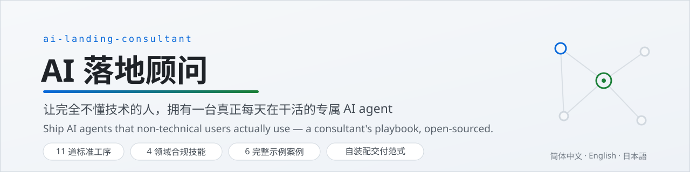
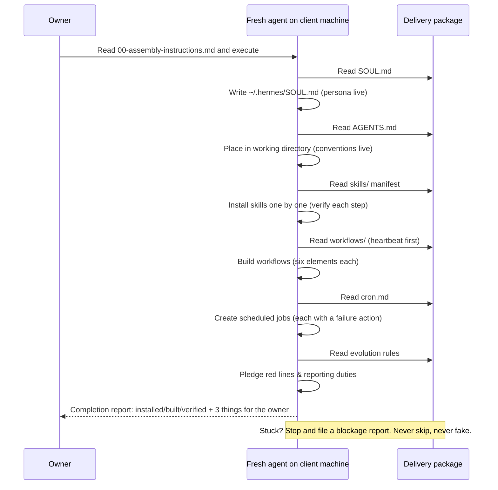
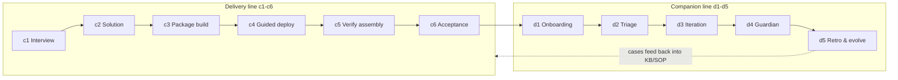
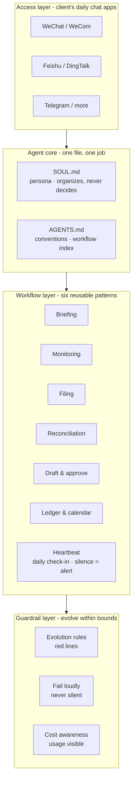

<div align="center">

<picture>
  <source media="(prefers-color-scheme: dark)" srcset=".github/assets/banner.svg">
  
</picture>

# Your client's data never leaves their machine

**English** ｜ [简体中文（原文）](README.md) ｜ 日本語 (landing summary)

[](LICENSE)
[](https://github.com/August06exe/ai-landing-consultant/actions/workflows/privacy.yml)
[](https://github.com/NousResearch/hermes-agent)
[](#)
[](CONTRIBUTING.md)

**We don't deliver documents. We deliver an agent that assembles itself.**

11 standard operating procedures · 8 consultant skills (4 domain-compliance packs included) · 6 complete sample cases · 15 field guides

[Get started](#quick-start) · [See a full case first](#six-complete-sample-cases) · [The methodology](#11-standard-operating-procedures) · [FAQ](#faq)

</div>

---

## What is this

Not another agent framework — an **open-source playbook for the "landing consultant" role itself**.

Self-hosted AI agents are a toy for technical users and a wall of jargon for everyone else: installed but directionless, requirements that never get pinned down, nobody to design the workflows, nobody on call when things break. This project turns what a seasoned consultant does — **interview, design, package, deploy, accompany** — into 11 standard operating procedures executed by an AI consultant loaded with our prompt system. The outcome: a completely non-technical business owner receives an AI agent that is *theirs* — a persona tailored to their trade, wired into the chat apps they already use, running workflows that fire every day, evolving within guardrails.

> **Positioning**: the methodology is platform-agnostic. The current implementation targets [Hermes Agent](https://github.com/NousResearch/hermes-agent) (self-hosted, first-class WeChat/Feishu/DingTalk support). PRs for other platforms welcome.

## Red lines before requirements

The first principle of the whole system — and what separates it from "it runs, ship it" deployment guides:

- **Domain red lines come first.** Four skill packs (finance, investment, data, legal) ship with compliance red lines and forbidden-phrase lists. "Place the trade for me" or "draft my tax opinion" must produce a refusal plus escalation — never blind compliance.
- **Organize, never decide.** Every delivered agent is written as an information organizer — judgment calls and execution go back to the owner.
- **Three-layer privacy guard.** Real client files, quotes, and screen recordings never enter the repo. `.gitignore` + pre-commit gatekeeper + CI privacy checks. Fork freely; nothing sensitive comes along. See [SECURITY.md](SECURITY.md).

## The core pattern: a delivery package that assembles itself

Deployment is done when "the agent is alive and the first model answers." Then you hand over the **delivery package** — and the fresh agent **builds itself into the client's dedicated assistant**: installs its persona, places its task conventions, installs skills, builds workflows (heartbeat first), sets up scheduled jobs, and files a completion report. It signs the *evolution rules* on day one: red lines, mandatory self-reporting of new skills, weekly self-checks.

```mermaid
flowchart LR
    subgraph S["Provider side - a repeatable production line"]
        BOSS["Owner / Consultant"] -->|"3-round interview"| CONSULT["Consultant agent<br/>prompt + 8 skills + KB + 11 SOPs"]
        CONSULT -->|"plan · owner signs off"| PACK
    end
    PACK["Delivery package<br/>self-assembly instructions<br/>SOUL + AGENTS + workflows + skills + evolution rules"]
    subgraph C["Client machine - client data never leaves"]
        BLANK["Fresh AI agent"] -->|"reads the package"| RUNTIME["Client-owned assistant<br/>persona + workflows + cron + guardrails"]
    end
    PACK -->|"guided deploy"| BLANK
    RUNTIME <-.|"WeChat / Feishu / DingTalk / Telegram"| USER["Non-technical end user"]
    RUNTIME -->|"evolution rules · weekly self-check"| RUNTIME
```

<details>
<summary><b>Watch the self-assembly sequence, step by step</b></summary>



</details>

## Quick start

| Who are you | First step | Then |
|---|---|---|
| **A business owner** who wants their own AI assistant | Hand this repo to anyone comfortable with computers (or any CLI agent) and have them read `01-顾问agent/提示词.md` + `03-SOP/c1-需求调研.md` | They'll start with a first-visit question sheet. Thirty minutes about your daily grind — the process takes it from there |
| **A freelancer or shop** that wants to sell AI landing services | Read [`04-运营/服务标准.md`](04-运营/服务标准.md) — three service tiers, acceptance standards, out-of-scope policy | Wake your consultant agent with `04-运营/启动指令.md` and run your first engagement through `03-SOP/` (first one free is the recommended playbook) |
| **You just want the knowledge base** | Read the [15 field guides](02-知识库/01-专题/) and [workflow recipes](02-知识库/05-配方库/01-六大通用模式配方.md) | Pull the latest official docs: `bash scripts/fetch-hermes-docs.sh` |

👀 **Non-technical? Read one complete case (10 minutes):** [Ramen shop owner](02-知识库/04-案例库/示例-拉面店老王/README.md) — interview to delivery package to user card, end to end. *(Case docs are in Chinese; the package structure is universal.)*

## Curation ledger (why this is trustworthy)

Every number below is countable inside the repo — `scripts/check-numbers.sh` re-verifies on demand:

- Instruction audit: **38 verdicts** — 25 consistent with official docs / **11 errors fixed in place** / 2 flagged (field guide 12)
- llms line-number anchors: **332 machine-verified**; 13 rotted anchors caught and fixed same day (check-anchors)
- **15 field guides**: every claim carries a source and date; 3-month staleness rule enforced
- **5 review rounds** including one isolation-reviewed external audit (6.8/10, archived in field guide 14) — negative findings kept on record
- All **6 sample cases are fictional and labeled as such** — the word "real" is reserved for real deliveries

## What's inside

| Module | Contents | Why it matters |
|---|---|---|
| 🧠 **Consultant prompt** | A senior landing consultant's persona: evidence-driven, ROI-minded, 1-3-1 escalation, risk-first | Load it into any CLI agent and go |
| 🛠️ **8 skills** | grill-me/grilling interview method · deep-search · web-crawler · **four domain advisors: finance / investment / data / legal**, each with compliance red lines | Built on [mattpocock/skills](https://github.com/mattpocock/skills) (MIT) |
| 📚 **Knowledge base ×15** | Channel selection (including the WeChat iLink pitfalls), Windows/Desktop deployment, model access, ops triage, secrets & privacy baseline, pain-point research, **a complete Desktop user guide**, **a full instruction audit** (38 verdicts, 11 fixed in-place), **a world-class facade benchmark** | Every claim carries a source and date; instructions audited line-by-line against official docs |
| 🧩 **Workflow recipes** | Six universal patterns · heartbeat recipe · machine-migration runbook | Recognize the pattern, copy the skeleton, finish with the 7-step methodology |
| 🍜 **Sample cases ×6** | See the table below | One package skeleton × four compliance regimes |
| 🏭 **11 SOPs (v2)** | Delivery line c1-c6 + companion line d1-d5, **each with acceptance checklists** | Consulting that replicates — not vibes |
| 📋 **Full templates** | Client intake, delivery package (8 pieces), quotes, lead tracker, monthly retro | Walk out with a business |
| 📜 **Service standard** | Three tiers, retainer SLA, out-of-scope policy, review grading | The constitution, if you want to sell this |
| 🔌 **Installable skill pack** | The 11 SOPs as SKILL.md files (`skills-tap/`) + Hermes plugin shell (`.hermes-plugin/`) | `hermes plugins install` or plain copy — works in any CLI agent |

### Six complete sample cases

*All fictional — and yes, template-ready.*

| Case | Domain / tier* | One-liner | How red lines land |

*tier = service package (L1/L2/L3, see Service standard §1); sensitivity tiers (L-sensitive etc.) follow the secrets baseline guide — both are Chinese-language docs, the structure is the point.
|---|---|---|---|
| [🍜 Ramen shop](02-知识库/04-案例库/示例-拉面店老王/README.md) | Restaurant / L2 | Morning briefings, social posts, review triage, ledger nudges | Three red lines in the evolution rules |
| [📒 Accounting firm](02-知识库/04-案例库/示例-财务会计月结/README.md) | Finance / L-sensitive* | Monthly bookkeeping triage, zero external skills | "Organize, never decide" in every workflow |
| [📈 Individual investor](02-知识库/04-案例库/示例-投资人大盘追踪/README.md) | Investment / L3 | Pre-market briefings, never directional advice | Forbidden-phrase list baked into AGENTS.md; output stays private |
| [🦷 Dental clinic](02-知识库/04-案例库/示例-诊所预约管理/README.md) | Healthcare / L3-lite | Appointment management | Patient data minimized (surname + last digits); records never touched |
| [🥗 Review butler](02-知识库/04-案例库/示例-餐饮评价管家/README.md) | Restaurant / L2 | Review triage + reply drafts (honest human-fed data) | Drafts never auto-sent; food-safety & refunds escalate to human |
| [🗓️ Tax-deadline alarm](02-知识库/04-案例库/示例-征期提醒官/README.md) | Sole proprietor / L1-minimal | Filing-deadline reminders; the ideal second engagement | Remind only, never file; never touches tax credentials |

## 11 standard operating procedures



Inputs, actions, outputs and acceptance checklists per procedure: [`03-SOP/`](03-SOP/README.md). The thinking path behind them: [`workflow methodology`](03-SOP/方法论-工作流设计.md). *(In Chinese — the structure is the point.)*

<details>
<summary><b>What's inside a delivery package (layered anatomy)</b></summary>



</details>

<details>
<summary><b>Repository map</b></summary>

```
01-顾问agent/   Consultant prompt + skills/ (interview, research, crawler + 4 domain advisors)
02-知识库/      Knowledge base: 15 field guides | official docs (script-pulled) | reference skills | 6 cases | recipes
03-SOP/         c1-c6 delivery | d1-d5 companion | workflow methodology (each with checklists)
04-运营/        Operations: kickoff prompt, service standard, file conventions, quotes, retros
05-客户/        _templates/ (active client data stays local — see .gitignore)
06-归档/        Closed engagements & history (local)
07-工作区/      Agent scratch space (local)
docs/           GitHub Pages landing (not enabled) | i18n glossary
```

</details>

## Roadmap (re-ranked in v2.0: real-world validation beats polish)

> Per the independent external review (field guide 14): our biggest gap is *external validity*, not documentation. Priorities re-ordered accordingly.

- [x] Theory pinned / facade rebuilt / review chain established (v1.x, 2026-09-18/19)
- [x] Maintenance-tax hedge: `check-anchors.sh` machine verification (332 assertions baselined) + platform-coupling statement + go-to-market kit (v2.0, 2026-09-19)
- [ ] 🔴 **First real ignition**: complete one real (or free-pilot) engagement per `docs/first-ignition.md`, backfill the ignition log, and land the case — **top priority; everything else yields**
- [ ] 🔴 Demo video up top: 60-second "hand over the package → self-assembly → first chat message" capture (storyboard ready in `04-运营/宣传素材/`)
- [x] 11 SOPs packaged as an installable skill group (v2.x, 2026-09-19): `skills-tap/` with 11 SKILL.md files (tap / copy-paste) + `.hermes-plugin/` thin shell (register verified 11/11)
- [ ] On-device install verification: real-Hermes testing of both channels (post-ignition)
- [ ] Second platform adapter: OpenClaw (minimal checklist in `02-知识库/00-平台适配层.md`)
- [ ] One-click deploy wizard: c4 as a next-next-done installer (upgrade/uninstall/rollback included)
- [ ] Content-quality CI: package-structure lint + case-link checker
- [ ] Industry playbook marketplace

## FAQ

<details>
<summary><b>How is this different from asking ChatGPT to "write me a plan"?</b></summary>

ChatGPT hands you a document and leaves. This is a full production line: how to interview, how the plan gets signed off, what the delivery package looks like, how acceptance works, who fixes breakage, how the agent evolves — and the artifact isn't a document, it's a 24/7 agent working inside the client's own chat apps.
</details>

<details>
<summary><b>Hermes only?</b></summary>

The current implementation targets Hermes (self-hosted, self-evolving skills, native Chinese-channel support — the best fit for individuals and small businesses). The methodology — interviews, SOPs, self-assembly, companion service — is platform-agnostic; switching platforms mostly means swapping the knowledge base and package internals. Porting PRs very welcome.
</details>

<details>
<summary><b>Can I charge money for deployments built on this?</b></summary>

Yes — MIT. The service standard and quote templates in `04-运营/` were designed for billable delivery. Follow your local regulations and upstream licenses.
</details>

<details>
<summary><b>Do I need to know how to code?</b></summary>

The <b>consultant</b> role needs basic computer literacy. The <b>end user needs none</b> — that's the entire point. The documented out-of-the-box path: download Desktop → model connected → channel connected → first scheduled job, six steps, zero mandatory command lines. See <a href="02-知识库/01-专题/11-Hermes-Desktop完整使用指南.md">field guide 11</a> (Chinese).
</details>

## Contributing

The most valuable contribution is a **real landing case** — open an Issue with the [case template](.github/ISSUE_TEMPLATE/案例投稿.md). Full workflow in [CONTRIBUTING.md](CONTRIBUTING.md), including a six-tier `good first issue` system. First time here? Start at `good first issue: typo` or `case`. Translators: read the [i18n glossary](docs/i18n-术语表.md) first. Security: [SECURITY.md](SECURITY.md).

## Credits & license

- [Hermes Agent](https://github.com/NousResearch/hermes-agent) (MIT) — current target platform
- [mattpocock/skills](https://github.com/mattpocock/skills) (MIT) — the grilling interview method
- [obra/superpowers](https://github.com/obra/superpowers) (MIT) — methodology-as-skills and release engineering patterns
- [awesome-openclaw-usecases](https://github.com/hesamsheikh/awesome-openclaw-usecases) (MIT) — use-case entry format

Full list in [THIRD-PARTY-CREDITS.md](THIRD-PARTY-CREDITS.md). Released under [MIT](LICENSE) — take it, sell with it, and come back to file an issue telling us who you landed it for.

<div align="center">

**If this playbook helped you sign your first client, a ⭐ back is appreciated.**

</div>
