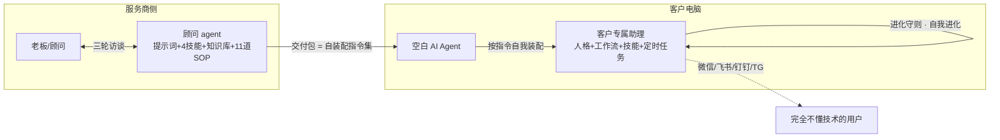

<div align="center">

# 🎯 AI 落地顾问 · ai-landing-consultant

**一套帮特定用户部署专属 AI agent、并落地第一套真正每天都在用的工作流的顾问系统。**

把资深落地顾问的完整方法论做成 agent 可执行：
提示词 + 技能 + 知识库 + 11 道标准工序。

[](LICENSE)
[](https://github.com/August06exe/ai-landing-consultant/actions/workflows/privacy.yml)
[](https://github.com/NousResearch/hermes-agent)
[](#)
[](#)
[](#)

[English](README.en.md) · 快速开始 · 方法论 · FAQ

</div>

---

## 这是什么

不是又一个 agent 框架，而是一个**「落地顾问」角色本身的开箱系统**。

自托管 AI agent（如 Hermes）对技术玩家是玩具，对普通人是天书：装好了不知道让它干嘛、需求聊不清、工作流没人设计、出了问题没人管。**这个项目把顾问干的事——访谈需求、设计方案、制作交付包、部署验证、陪跑进化——拆成 11 道标准工序**，交给一个加载了本系统提示词的 AI 顾问去执行。

结果：给一个完全不懂技术的特定用户（比如一位开餐馆的老板），交付一台**属于他自己的** AI agent——按他的业务定制人格、接通他日常用的聊天渠道、带着几条天天自动运转的工作流，并且**在护栏内自我进化**。

> **定位声明**：方法论是平台无关的。当前实现面向 [Hermes Agent](https://github.com/NousResearch/hermes-agent)（自托管、技能自进化、官方支持微信/飞书/钉钉等国内渠道）；欢迎 PR 适配其他平台。

## 核心理念：交付包 = 自装配指令集

传统交付是「顾问写一堆文档，客户看不懂」。
本项目的交付范式：

> 部署只做到「agent 活了 + 第一个模型通了」，然后把**交付包**甩给那台空白 agent——
> **它自己按包内指令，把自己装配成客户专属的样子**：写入人格（SOUL.md）、安装技能、搭建工作流、配置定时任务，最后交一份完成报告。

装配完成后，随包附一份**《进化守则》**：划定禁区、要求它报告自己新写的技能、每周自检——让 AI 助理在护栏内**安全地自我进化**，而不是越用越歪。



## 这套系统里有什么

| 模块 | 内容 | 亮点 |
|---|---|---|
| 🧠 **顾问提示词** | 资深落地顾问人格：证据驱动、ROI 意识、1-3-1 决策请示、风险前置 | 装进任何 CLI agent 就能用 |
| 🛠️ **4 个技能** | grilling 拷问式访谈 · deep-search 调研 · web-crawler 抓取 | 站在 [mattpocock/skills](https://github.com/mattpocock/skills)（MIT）肩上 |
| 📚 **落地知识库** | 渠道对照与选型（含微信 iLink 的坑！）、Windows 部署、国内模型接入、运维排查路由表、**密钥与隐私基线**、客户端技能配装清单 | 每条结论带官方文档行号锚点 |
| 🍜 **完整示例案例** | 一个（虚构的）拉面店老板：档案→交付包→使用卡全流程成品 | `02-知识库/04-案例库/示例-拉面店老王/` |
| 🏭 **11 道标准工序（SOP）** | 交付线 c1-c6（三轮访谈→方案→交付包→部署→自装配验证→验收）+ 陪跑线 d1-d5（启动→分诊→迭代→进化守护→复盘归档） | 服务可以被复制，而不是每次靠灵感 |
| 📋 **全套模板** | 客户档案、交付包（自装配指令/SOUL/工作流/进化守则/使用卡）、报价单、线索表、月度复盘 | 拿走就能开张 |
| 📜 **服务标准** | 三层服务包、陪跑 SLA、超纲需求三档制、审校分级 | 想把它做成一门生意？宪法都给你写好了 |

## 快速开始

### 🅰 我是传统行业老板，想给自己配一个 AI 助理
1. 找一位会用电脑的朋友（或者任何 CLI AI agent），把这个仓库给 ta；
2. 让 ta 读 `01-顾问agent/提示词.md` + `03-SOP/c1-需求调研.md`，ta 会先给你一张「初访题单」；
3. 坐下来聊 30 分钟你每天重复在干什么——剩下的交给流程。

> 👀 **想先看成品？** 读 [`02-知识库/04-案例库/示例-拉面店老王/`](02-知识库/04-案例库/示例-拉面店老王/README.md)——一个（虚构的）拉面店老板从访谈到交付包到使用卡的完整案例。

### 🅱 我想用这套方法开展「AI 落地」服务
1. 读 `04-运营/服务标准.md`（服务怎么分层、怎么验收、怎么处理超纲需求）；
2. 用 `04-运营/启动指令.md` 的模板唤醒你的顾问 agent；
3. 按 `03-SOP/` 跑你的第一单（建议首单免费打样，按 `d5` 复盘把模板沉淀成自己的）。

### 🅲 我只要知识库
直接读 `02-知识库/01-专题/` 七份专题，或运行下面脚本拉取最新 Hermes 官方全量文档：

```bash
bash scripts/fetch-hermes-docs.sh
```

## 11 道标准工序

```
交付线：c1 需求调研(三轮访谈) → c2 方案设计 → c3 交付包制作 → c4 部署引导 → c5 自装配验证 → c6 验收交付
陪跑线：d1 陪跑启动 → d2 故障分诊(三级) → d3 工作流迭代(ROI排队) → d4 进化守护(月度体检) → d5 复盘与归档
```

## 目录地图

```
01-顾问agent/   提示词 + skills/（访谈/调研/爬虫）
02-知识库/      01-专题 | 02-官方文档(脚本拉取) | 03-参考技能 | 04-案例库(含示例-拉面店老王)
03-SOP/         c1-c6 交付线 | d1-d5 陪跑线
04-运营/        启动指令 | 服务标准 | 文件架构规范 | 报价单模板 | 线索表 | 月度复盘 | 改进看板
05-客户/        _模板/（在办客户数据不入库，见 .gitignore）
06-归档/        结案客户与历史版本（本地）
07-工作区/      agent 临时工作区（本地）
```

> 🔒 **隐私设计**：开源的是「产线」。真实客户档案、报价、录屏永远在本地（`.gitignore` 已锁定），随便 fork 不会带脏东西。

## Roadmap

- [ ] **平台适配层**：把交付包范式适配到 OpenClaw 等其他 agent（存量用户迁移指南）
- [ ] 行业工作流案例库：餐饮、贸易、诊所、物流……（首单结案后开始沉淀）
- [ ] 一键部署向导：把 c4 部署引导做成给小白点「下一步」的脚本
- [ ] 更多模型 provider 实测报告（国内直连方案）
- [ ] 英文文档全量化 · 行业配装包模板市场

## FAQ

**Q：和直接让 ChatGPT「帮我写个方案」有什么区别？**
ChatGPT 给你一篇文档就结束了。这套系统是一条完整生产线：怎么访谈、方案怎么拍板、交付包长什么样、装完怎么验收、坏谁处理、怎么进化——而且最终产物不是文档，是一台 7×24 在客户聊天渠道里干活的专属 agent。

**Q：只支持 Hermes 吗？**
当前实现面向 Hermes（自托管+技能自进化+国内渠道支持，最贴合个人/小微落地）。但方法论——访谈、SOP、自装配范式、陪跑——是平台无关的，换平台主要换 `02-知识库/` 和交付包里的技术细节。适配 PR 非常欢迎。

**Q：我可以拿它收费帮别人部署吗？**
可以，MIT。`04-运营/` 的服务标准和报价模板就是按「可收费交付」设计的。请遵守当地法规与上游平台许可。

**Q：用这套系统需要会编程吗？**
「顾问」角色需要基本电脑操作能力；**最终用户完全不需要**——这正是设计目标。

## 贡献

最被需要的贡献是**落地案例**（你用这套流程服务了谁、踩了什么坑）——用 [案例投稿模板](.github/ISSUE_TEMPLATE/案例投稿.md) 开 Issue 即可。其余见 [CONTRIBUTING.md](CONTRIBUTING.md)；安全问题见 [SECURITY.md](SECURITY.md)。

## 致谢与许可

- [Hermes Agent](https://github.com/NousResearch/hermes-agent)（MIT）— 当前目标平台
- [mattpocock/skills](https://github.com/mattpocock/skills)（MIT）— grilling 访谈法
- [awesome-hermes-skills](https://github.com/ZeroPointRepo/awesome-hermes-skills)（MIT）· [bytedance/agentkit-samples](https://github.com/bytedance/agentkit-samples)（Apache-2.0）

详见 [THIRD-PARTY-CREDITS.md](THIRD-PARTY-CREDITS.md)。本项目以 [MIT](LICENSE) 发布——拿去用，拿去赚钱，记得回来提 Issue 告诉我们你落地了谁。

<div align="center">

**如果这套流程帮你签下了第一单，欢迎回来给个 ⭐**

</div>
