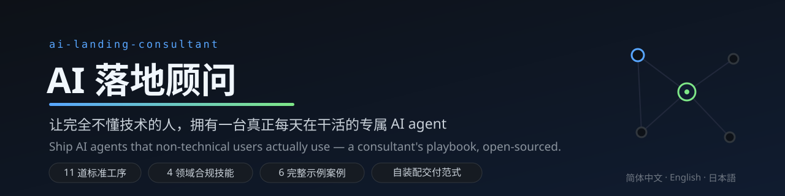
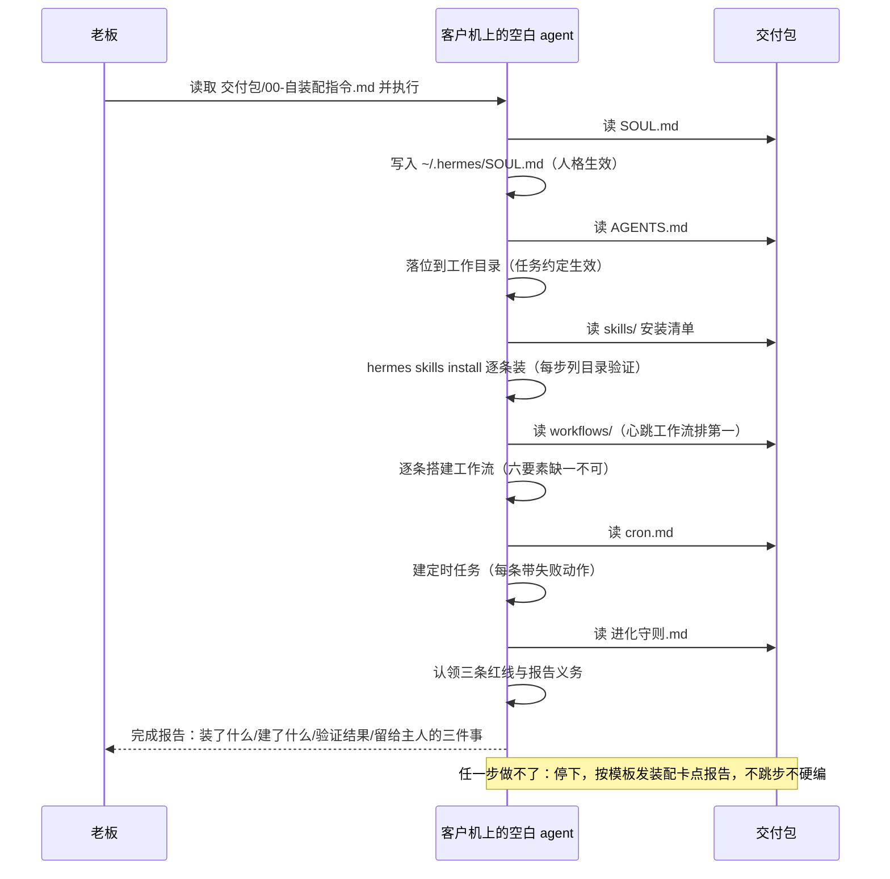
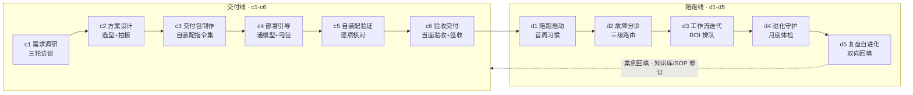
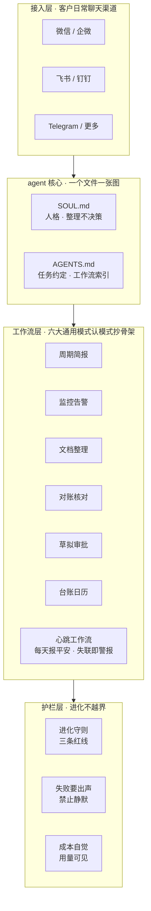

<div align="center">



# 客户的数据只住在客户电脑里

**简体中文** ｜ [English](README.en.md) ｜ [日本語](README.ja.md)

[](LICENSE)
[](https://github.com/August06exe/ai-landing-consultant/actions/workflows/privacy.yml)
[](https://github.com/NousResearch/hermes-agent)
[](#)
[](CONTRIBUTING.md)

**别人交付文档，我们交付一台会自己装配自己的 agent。**

11 道标准工序 · 8 个顾问技能（含 4 个领域合规包） · 6 个完整示例案例 · 13 份落地专题

[快速开始](#快速开始) · [先看案例](#六个完整示例案例) · [方法论](#11-道标准工序) · [FAQ](#faq)

</div>

---

## 这是什么

不是又一个 agent 框架，而是**「落地顾问」这个角色本身的开箱系统**。

自托管 AI agent 对技术玩家是玩具，对普通人是天书：装好了不知道让它干嘛、需求聊不清、工作流没人设计、出了问题没人管。本项目把资深顾问干的事——**访谈需求、设计方案、制作交付包、部署验证、陪跑进化**——拆成 11 道标准工序，交给一个加载了本系统提示词的 AI 顾问去执行。结果：给一位完全不懂技术的老板，交付一台**属于他自己的** AI agent——定制人格、接通他日常的聊天渠道、带着几条天天自动运转的工作流，且在护栏内自我进化。

> **定位声明**：方法论平台无关。当前实现面向 [Hermes Agent](https://github.com/NousResearch/hermes-agent)（自托管、官方支持微信/飞书/钉钉等国内渠道）；欢迎 PR 适配其他平台。

## 红线优先于需求

<sub>*Red lines before requirements.*</sub>

这是整个系统的第一原则，也是它与「能跑就行」的部署教程的本质区别：

- **领域红线前置**：财务/投资/数据/法务四类客户，对应顾问技能包自带合规红线与禁用词表——「帮我自动下单」「给我出税务方案」类输入，agent 必须输出拒绝+请示，而不是照办。
- **整理不决策**：交付的 agent 一律写成「信息整理者」——判断与执行类请求必须请示主人。
- **隐私三层防线**：真实客户档案/报价/录屏永不入库。`.gitignore` + pre-commit 门卫 + CI 隐私检查三道拦截，随便 fork 不带脏东西。详见 [SECURITY.md](SECURITY.md)。

## 核心范式：交付包 = 自装配指令集

部署只做到「agent 活了 + 第一个模型通了」，然后把**交付包**甩给那台空白 agent——**它自己按包内指令把自己装配成客户专属的样子**：写入人格、落位任务约定、安装技能、搭建工作流（心跳排第一）、配置定时任务，最后交完成报告。装配完成即交接《进化守则》：划定禁区、新技能必须报告、每周自检。

```mermaid
flowchart LR
    subgraph S["服务商侧 · 一条可复制的产线"]
        BOSS["老板/顾问"] -->|"三轮访谈定需求"| CONSULT["顾问 agent<br/>提示词 + 8技能 + 知识库 + 11道SOP"]
        CONSULT -->|"c2 方案 · 老板拍板"| PACK
    end
    PACK["交付包<br/>自装配指令集<br/>SOUL + AGENTS + 工作流 + 技能清单 + 进化守则"]
    subgraph C["客户电脑 · 客户的数据只住在这里"]
        BLANK["空白 AI agent"] -->|"读包自装配"| RUNTIME["客户专属助理<br/>人格 + 工作流 + 定时任务 + 护栏"]
    end
    PACK -->|"c4 部署引导 · 甩包"| BLANK
    RUNTIME <-.|"微信 / 飞书 / 钉钉 / Telegram"| USER["完全不懂技术的用户"]
    RUNTIME -->|"进化守则 · 每周自检"| RUNTIME
```

<details>
<summary><b>看自装配的完整时序（agent 逐步干了什么）</b></summary>



</details>

## 快速开始

| 你是谁 | 第一步 | 接下来 |
|---|---|---|
| **传统行业老板**，想给自己配 AI 助理 | 把本仓库给任何会用电脑的朋友（或任意 CLI AI agent），让 ta 读 `01-顾问agent/提示词.md` + `03-SOP/c1-需求调研.md` | ta 会先给你一张「初访题单」；坐下来聊 30 分钟你每天重复在干什么，剩下的交给流程 |
| **想开展 AI 落地服务的人** | 读 [`04-运营/服务标准.md`](04-运营/服务标准.md)（三层服务包/验收/超纲三档制） | 用 `04-运营/启动指令.md` 唤醒你的顾问 agent，按 `03-SOP/` 跑第一单（建议首单免费打样） |
| **只要知识库** | 直接读 [`02-知识库/01-专题/`](02-知识库/01-专题/) 十三份专题与[配方库](02-知识库/05-配方库/01-六大通用模式配方.md) | 拉最新官方文档：`bash scripts/fetch-hermes-docs.sh` |

👀 **看不懂技术？10 分钟看一个完整案例**：[拉面店老王](02-知识库/04-案例库/示例-拉面店老王/README.md)——从访谈到交付包到使用卡的全过程。

## 这套系统里有什么

| 模块 | 内容 | 亮点 |
|---|---|---|
| 🧠 **顾问提示词** | 资深落地顾问人格：证据驱动、ROI 意识、1-3-1 决策请示、风险前置 | 装进任何 CLI agent 就能用 |
| 🛠️ **8 个技能**（另有 deep-research 完整管线仅本地自用不入库，不计入） | grill-me/grilling 拷问式访谈 · deep-search 调研 · web-crawler 抓取 · **财务/投资/数据/法务四个领域顾问**（各带合规红线） | 站在 [mattpocock/skills](https://github.com/mattpocock/skills)（MIT）肩上 |
| 📚 **落地知识库 ×13** | 渠道对照与选型（含微信 iLink 的坑）、Windows/Desktop 部署、模型接入、运维排查、**密钥与隐私基线**、落地痛点调研、专业领域盘点、**Desktop 完整使用指南**、**指令核对清单**、**门面对标解剖** | 每条结论带来源与日期，指令断言逐条核对过官方文档（38 行判定：11 ✗ 当场修源） |
| 🧩 **工作流配方库** | 六大通用模式配方 · 心跳工作流配方 · 换机迁移 runbook | 认模式→抄骨架→按方法论七步成成品 |
| 🍜 **完整示例案例 ×6** | 见下方对照表 | 同一交付包骨架 × 四种领域红线落法 |
| 🏭 **11 道标准工序（SOP v2）** | 交付线 c1-c6 + 陪跑线 d1-d5，**每道带「质量标尺」勾选项** | 服务可以被复制，而不是每次靠灵感 |
| 📋 **全套模板** | 客户档案、交付包九件套、报价单、线索表、月度复盘 | 拿走就能开张 |
| 📜 **服务标准** | 三层服务包、陪跑 SLA、超纲需求三档制、审校分级 | 想把它做成一门生意？宪法都给你写好了 |

### 六个完整示例案例

*以下案例均为虚构，可直接当模板抄。*

| 案例 | 领域/服务包 | 一句话 | 红线落法 |
|---|---|---|---|
| [🍜 拉面店老王](02-知识库/04-案例库/示例-拉面店老王/README.md) | 餐饮/L2 | 早报+朋友圈文案+评价整理+台账提醒（**v1 最小骨架入门**，投稿模板请用征期提醒官） | 进化守则三条红线 |
| [📒 小会计事务所](02-知识库/04-案例库/示例-财务会计月结/README.md) | 财务/L-敏感 | 月结流水整理，零外部技能 | 「整理不决策」落到每条工作流 |
| [📈 个人投资者](02-知识库/04-案例库/示例-投资人大盘追踪/README.md) | 投资/L3·M-敏感 | 盘前简报，绝不输出方向性措辞 | 禁用词表全文进 AGENTS.md；输出仅自用 |
| [🦷 口腔诊所](02-知识库/04-案例库/示例-诊所预约管理/README.md) | 医疗/L3 轻量·H-敏感 | 预约管理 | 患者信息最小化（姓氏+尾号），病历影像永不接触 |
| [🥗 餐饮评价管家](02-知识库/04-案例库/示例-餐饮评价管家/README.md) | 餐饮/L2 | 差评分级+回复草稿（人工投喂的诚实设计） | 不代发不代删；🔴 食安/退款转人工 |
| [🗓️ 征期提醒官](02-知识库/04-案例库/示例-征期提醒官/README.md) | 个体户/L1 最小 | 征期节点提醒，第二单练手首选 | 只提醒不代办；不碰税号不编日期 |

## 11 道标准工序



每道工序的输入/动作/产出与质量标尺见 [`03-SOP/`](03-SOP/README.md)；工序背后的思考路径见 [`方法论-工作流设计`](03-SOP/方法论-工作流设计.md)。

<details>
<summary><b>交付包里装了什么（分层解剖）</b></summary>



</details>

<details>
<summary><b>目录地图</b></summary>

```
01-顾问agent/   提示词 + skills/（访谈/调研/爬虫 + 财务/投资/数据/法务领域顾问）
02-知识库/      01-专题×13 | 02-官方文档(脚本拉取) | 03-参考技能 | 04-案例库(示例案例×6) | 05-配方库
03-SOP/         c1-c6 交付线 | d1-d5 陪跑线 | 方法论-工作流设计（每道带质量标尺）
04-运营/        启动指令 | 服务标准 | 文件架构规范 | 报价单模板 | 线索表 | 月度复盘
05-客户/        _模板/（在办客户数据不入库，见 .gitignore）
06-归档/        结案客户与历史版本（本地）
07-工作区/      agent 临时工作区（本地）
docs/           GitHub Pages landing（未启用）| i18n 术语表
```

</details>

## Roadmap

- [x] 四案例矩阵 / 配方库 / 四领域技能包 / SOP v2（v1.0，2026-09-16）
- [x] 理论钉死：Desktop 完整使用指南 + 指令断言全量核对（38 行判定，11 ✗ 当场修源，2026-09-18）
- [ ] **Demo 视频置顶**：60 秒「甩包→自装配→微信收汇报」录屏（脱敏）
- [ ] 11 道工序打包成 Hermes 技能组，两步走：①转 skills tap 仓库（零代码，`hermes skills tap add` 即装）②薄壳插件（plugin.yaml+register，参照 superpowers 形态）——`hermes plugins install` 一条命令装顾问
- [ ] 平台适配层：交付包范式适配 OpenClaw 等（存量用户迁移指南）
- [ ] 一键部署向导：c4 做成给小白点「下一步」的脚本（含升级/卸载/回滚）
- [ ] 内容质量 CI：交付包九件套结构 lint + 案例库链接检查
- [ ] 行业配装包模板市场 · 英文文档全量化（GitHub Action 自动翻译思路）

## FAQ

<details>
<summary><b>和直接让 ChatGPT「帮我写个方案」有什么区别？</b></summary>

ChatGPT 给你一篇文档就结束了。这套系统是一条完整生产线：怎么访谈、方案怎么拍板、交付包长什么样、装完怎么验收、坏谁处理、怎么进化——而且最终产物不是文档，是一台 7×24 在客户聊天渠道里干活的专属 agent。
</details>

<details>
<summary><b>只支持 Hermes 吗？</b></summary>

当前实现面向 Hermes（自托管+技能自进化+国内渠道支持，最贴合个人/小微落地）。方法论——访谈、SOP、自装配范式、陪跑——是平台无关的，换平台主要换 `02-知识库/` 和交付包里的技术细节。适配 PR 非常欢迎。
</details>

<details>
<summary><b>我可以拿它收费帮别人部署吗？</b></summary>

可以，MIT。`04-运营/` 的服务标准和报价模板就是按「可收费交付」设计的。请遵守当地法规与上游平台许可。
</details>

<details>
<summary><b>用这套系统需要会编程吗？</b></summary>

「顾问」角色需要基本电脑操作能力；<b>最终用户完全不需要</b>——这正是设计目标。开箱即用的文档级结论：从下载 Desktop 到「模型通+渠道通+第一条定时任务」共 6 步，全程无一行必敲的代码，详见<a href="02-知识库/01-专题/11-Hermes-Desktop完整使用指南.md">专题 11</a>。
</details>

## 贡献

最被需要的贡献是**落地案例**——用 [案例投稿模板](.github/ISSUE_TEMPLATE/案例投稿.md) 开 Issue，全流程见 [CONTRIBUTING.md](CONTRIBUTING.md)（含 `good first issue` 六档标签体系）。第一次参与？从 `good first issue: typo` 或 `case` 开始。翻译请先读 [i18n 术语表](docs/i18n-术语表.md)。安全问题见 [SECURITY.md](SECURITY.md)。

## 致谢与许可

- [Hermes Agent](https://github.com/NousResearch/hermes-agent)（MIT）— 当前目标平台
- [mattpocock/skills](https://github.com/mattpocock/skills)（MIT）— grilling 访谈法
- [obra/superpowers](https://github.com/obra/superpowers)（MIT）— 方法论技能化与发布工程范式
- [awesome-openclaw-usecases](https://github.com/hesamsheikh/awesome-openclaw-usecases)（MIT）— 用例条目格式

详见 [THIRD-PARTY-CREDITS.md](THIRD-PARTY-CREDITS.md)。本项目以 [MIT](LICENSE) 发布——拿去用，拿去赚钱，记得回来提 Issue 告诉我们你落地了谁。

<div align="center">

**如果这套流程帮你签下了第一单，欢迎回来给个 ⭐**

</div>
